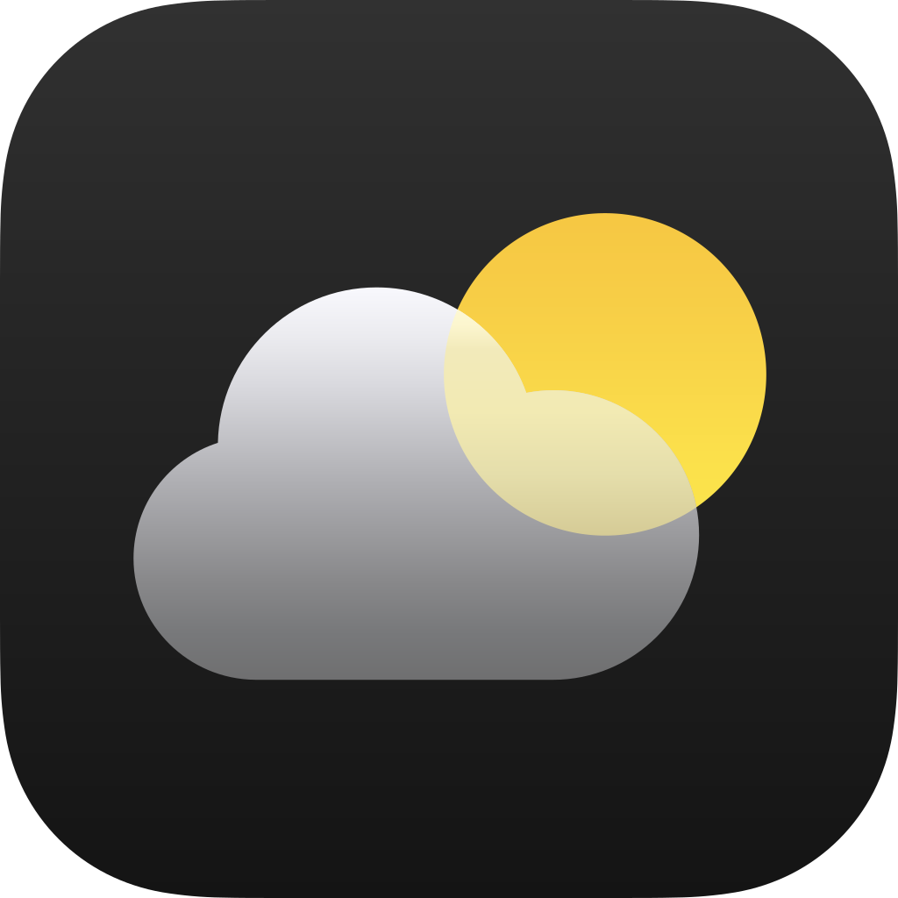

<div align="center">
  
    <h1>WeatherApp</h1>
</div>

This Swift-based project leverages the OpenWeatherMap API to fetch real-time weather data based on the user's location. It displays essential weather information including temperature, humidity, and wind speed.

## Features

- **Location-Based Weather**: Accurately determines the user's location and fetches weather data accordingly.
- **Key Weather Metrics**: Provides essential weather information such as temperature (including min and max), humidity, and wind speed.
- **User-Friendly Interface**: Offers a clean and intuitive user interface for easy interaction.

## Getting Started

1. **Clone the Repository:**
   ```bash
   git clone https://github.com/ByakkoHvsc/WeatherApp.git
   
2. Open in Xcode: Open the project in Xcode.
   
3. Obtain an API Key: Sign up for a free OpenWeatherMap API key at [OpenWeatherMap](https://openweathermap.org/api).
   
4. Replace API Key: Update the placeholder API key in the code with your obtained key.

5. Build and Run: Build and run the app on a simulator or physical device.

## Contributing

Contributions are welcome! Please fork the repository and submit a pull request.

## Disclaimer

This project is a recreation of an existing project for educational purposes. All credits go to the original creators.
